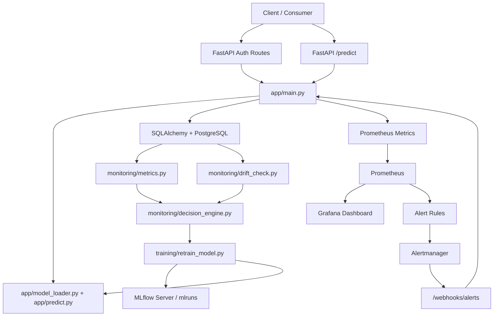

# Classifier Interview Preparation Guide

This guide is based on the actual repository at `C:\2026\Projects\Classifier`. It is intentionally implementation-specific and cites concrete files, functions, classes, and configuration.

## Repository Map

- `app/`: FastAPI inference service, auth, schemas, database wiring, metrics, logging.
- `training/`: initial training script and automated retraining pipeline.
- `monitoring/`: model health metrics, drift detection, retraining decision engine.
- `tests/`: API/auth/monitoring tests with SQLite-based dependency override.
- `alerting/`: Prometheus alert rules and Alertmanager routing.
- `grafana/`: provisioning plus an ML observability dashboard.
- `.github/workflows/ci.yml`: CI/CD pipeline.
- `Dockerfile`, `docker-compose.yml`: container build and local multi-service orchestration.
- `config.py`: centralized environment-backed configuration.
- `saved_models/`: serialized model artifacts.
- `mlruns/`, `mlflow.db`: MLflow metadata and model artifacts checked into the repo.
- `data/creditcard.csv`: training/reference data used by both training and drift detection.

---

# FastAPI

## 1. What is it?
FastAPI is a Python web framework for building APIs with type hints, automatic validation, and auto-generated docs.

## 2. Why is it needed?
This project needs an HTTP layer to expose fraud predictions, health checks, auth, monitoring triggers, and alert webhooks.

## 3. Why was it used in THIS project?
The service entry point in `app/main.py` defines the API using `FastAPI(...)` at line 37 and registers all routes directly on the app object.

## 4. Where is it used?
- `app/main.py`
- `tests/conftest.py`
- `tests/test_predict.py`
- `tests/test_auth.py`
- `tests/test_monitoring.py`

## 5. How does it work internally?
Uvicorn loads `app.main:app`. FastAPI parses request bodies into Pydantic models, resolves dependencies like `get_db()` and `get_current_user()`, runs the handler, serializes the response, and exposes OpenAPI docs automatically. In this repo, `/predict` accepts a `PredictionRequest`, authenticates the caller, executes model inference, writes a `PredictionLog`, updates Prometheus metrics, and returns a `PredictionResponse`.

## 6. Advantages
- Very low boilerplate
- Native validation via type hints
- Strong testability with dependency injection
- Swagger UI and OpenAPI out of the box

## 7. Limitations
- Sync route handlers can block the event loop if heavy work is done inside them
- Background workflows here are still in-process, not isolated workers
- Startup side effects can become brittle

## 8. Alternatives
- Flask: lighter, simpler, less structured
- Django REST Framework: stronger batteries-included stack
- gRPC: better for internal low-latency typed contracts

## 9. Why was this chosen instead of those alternatives?
The repo favors fast API development, type-driven request/response contracts, and easy docs. That fits FastAPI better than Flask. The service is also smaller than a typical DRF app.

## 10. Common mistakes developers make.
- Doing long CPU-bound work inside request handlers
- Relying on import-time side effects
- Treating validation as equivalent to business rule enforcement

## 11. Real-world best practices.
- Move startup tasks into explicit lifespan hooks
- Keep handlers thin and push logic into services
- Add exception handlers and structured error models
- Run multiple workers behind a process manager

## 12. Possible improvements for this project.
- Move `Base.metadata.create_all(bind=engine)` out of import/startup in `app/main.py:44`
- Add versioned routes like `/api/v1/...`
- Add explicit response/error schemas for failures

## 13. Interview Questions
- Beginner
  - What does FastAPI provide beyond Flask?
  - How does dependency injection work in FastAPI?
- Intermediate
  - How are request validation and response serialization handled?
  - What are the tradeoffs of sync vs async endpoints?
- Advanced
  - How would you scale this API under high inference traffic?
  - How would you prevent startup side effects from hurting reliability?
- Project-specific
  - Why is `/predict` protected but `/webhooks/alerts` is not?
  - What happens inside the `/predict` route in this repo?

## 14. Model Answers
- FastAPI adds type-driven validation, dependency injection, and automatic OpenAPI generation.
- Dependency injection resolves functions like `get_db` and `get_current_user` before the handler runs.
- FastAPI uses Pydantic models for body parsing and serialization.
- Sync handlers are simpler, but heavy CPU work can block workers.
- In this repo, `/predict` authenticates, runs `make_prediction`, writes to the DB, updates metrics, logs the event, and returns a typed response.

## 15. 30-second explanation
FastAPI is the serving layer for the fraud model. It exposes prediction, health, auth, monitoring, and alert endpoints with typed contracts and dependency injection.

## 16. 2-minute explanation
The API lives in `app/main.py`. FastAPI receives requests, validates them through Pydantic, injects dependencies like the SQLAlchemy session and current user, then routes to the relevant handler. The most important path is `/predict`: it receives a feature vector, authenticates via bearer token or API key, runs inference through the loaded scikit-learn model, stores an audit log in the `predictions` table, emits Prometheus metrics, and returns prediction metadata. Operational endpoints like `/health`, `/ready`, `/run-monitoring`, `/model-metrics`, and `/webhooks/alerts` make the service observable and controllable.

## 17. Whiteboard explanation
Draw a client calling FastAPI. Show dependency injection branches to auth and DB. Then show route handlers going to model inference, PostgreSQL, and Prometheus metrics. Add docs generation off the side.

---

# Pydantic

## 1. What is it?
Pydantic is a data validation and parsing library that turns Python type annotations into runtime-validated models.

## 2. Why is it needed?
The API needs safe request/response contracts for prediction payloads and auth payloads.

## 3. Why was it used in THIS project?
`app/schemas.py` defines `PredictionRequest` and `PredictionResponse`, while `app/auth.py` defines `TokenRequest`, `TokenResponse`, and `UserInfo`.

## 4. Where is it used?
- `app/schemas.py`
- `app/auth.py`
- `app/main.py`

## 5. How does it work internally?
FastAPI inspects route annotations, constructs Pydantic models from incoming JSON, validates types, and returns 422 on schema failures. Response models are also serialized through Pydantic.

## 6. Advantages
- Clear contracts
- Automatic validation
- Less manual parsing

## 7. Limitations
- Current `PredictionRequest` only checks `List[float]`, not feature length or semantics
- Validation does not guarantee ML correctness

## 8. Alternatives
- Marshmallow
- Hand-written validation
- Dataclasses plus custom validators

## 9. Why was this chosen instead of those alternatives?
FastAPI integrates natively with Pydantic, so it is the path of least resistance and highest clarity here.

## 10. Common mistakes developers make.
- Validating types but not domain constraints
- Returning raw dicts with inconsistent schemas

## 11. Real-world best practices.
- Validate exact feature count
- Add field descriptions and examples
- Encode stronger invariants in models

## 12. Possible improvements for this project.
- Enforce exactly 30 features in `PredictionRequest`
- Add named feature schema instead of an unstructured list

## 13. Interview Questions
- Beginner
  - What problem does Pydantic solve?
- Intermediate
  - Why does a malformed JSON body return 422 in FastAPI?
- Advanced
  - How would you model tabular ML input more safely than `List[float]`?
- Project-specific
  - What validation gap exists in `PredictionRequest`?

## 14. Model Answers
- Pydantic validates and parses structured input/output data from type hints.
- FastAPI uses Pydantic to validate bodies before calling the handler.
- A safer model would enforce feature names, lengths, numeric bounds, and optional metadata.
- This repo does not enforce the expected 30-feature shape at the schema layer.

## 15. 30-second explanation
Pydantic gives the API typed contracts for auth and predictions, but the current prediction schema is still too loose for production.

## 16. 2-minute explanation
This repo uses Pydantic as the schema backbone for both auth and inference. `PredictionRequest` accepts feature arrays and `PredictionResponse` standardizes model output. `TokenRequest` and `TokenResponse` formalize login. The strength is simplicity and tight FastAPI integration. The weakness is that the prediction request only validates that `features` is a list of floats; it does not validate the expected feature count or feature meaning, so some bad inputs can still reach the model and fail later.

## 17. Whiteboard explanation
Show raw JSON entering FastAPI, being transformed into a Pydantic model, then either returning 422 or continuing into business logic.

---

# SQLAlchemy

## 1. What is it?
SQLAlchemy is a Python toolkit for database connectivity and ORM-based object mapping.

## 2. Why is it needed?
The project logs every prediction for auditability, model monitoring, and drift analysis.

## 3. Why was it used in THIS project?
`app/database.py` creates the engine and session factory, and `app/models.py` maps the `predictions` table through `PredictionLog`.

## 4. Where is it used?
- `app/database.py`
- `app/models.py`
- `app/main.py`
- `monitoring/metrics.py`
- `monitoring/drift_check.py`
- `monitoring/decision_engine.py`
- `tests/conftest.py`

## 5. How does it work internally?
`SessionLocal` is created in `app/database.py`. Route handlers obtain a session through `get_db()`. ORM objects like `PredictionLog(...)` are added and committed. Monitoring code separately uses `pandas.read_sql` against a direct engine to compute aggregate health signals.

## 6. Advantages
- Clean ORM for simple persistence
- Easy engine switching between PostgreSQL and SQLite
- Useful testing story via dependency override

## 7. Limitations
- Mixed ORM plus raw SQL/pandas access patterns
- No migrations
- Table creation happens automatically at app startup

## 8. Alternatives
- Raw psycopg2
- SQLModel
- Django ORM

## 9. Why was this chosen instead of those alternatives?
SQLAlchemy is flexible and already fits FastAPI well without requiring a larger framework.

## 10. Common mistakes developers make.
- Sharing sessions globally
- Skipping migrations
- Letting schema creation happen implicitly in production

## 11. Real-world best practices.
- Use Alembic migrations
- Separate read and write repositories/services
- Add indexes based on query patterns

## 12. Possible improvements for this project.
- Add an index on `created_at`
- Store richer metadata like request ID, user identity, and model input hash
- Use JSONB for PostgreSQL-specific querying if staying on Postgres

## 13. Interview Questions
- Beginner
  - What is an ORM?
- Intermediate
  - How does this project create and use DB sessions?
- Advanced
  - Why is automatic `create_all` risky in production?
- Project-specific
  - How is prediction data stored in this repo?

## 14. Model Answers
- An ORM maps rows and tables to Python objects and classes.
- This repo uses `SessionLocal` from `app/database.py` and injects it with `get_db()`.
- `create_all` is risky because it is not a controlled migration process and can hide schema drift.
- Prediction records are stored in `PredictionLog` with JSON input, prediction, confidence, latency, model version, and timestamp.

## 15. 30-second explanation
SQLAlchemy persists prediction logs and abstracts the database connection layer across environments.

## 16. 2-minute explanation
The database layer is intentionally small. `app/database.py` creates the engine based on `config.DATABASE_URL`, with SQLite-specific connection arguments for tests. `app/models.py` defines a single `PredictionLog` table used as the operational fact table for monitoring. In the API, each prediction is committed via the ORM. In the monitoring modules, the same data is read back through SQL into pandas for metric computation and drift workflows. The design is simple, but it lacks migrations and more production-grade schema governance.

## 17. Whiteboard explanation
Draw FastAPI writing `PredictionLog` objects through SQLAlchemy into PostgreSQL. Then show monitoring scripts reading the same table into pandas.

---

# PostgreSQL And SQLite

## 1. What is it?
PostgreSQL is the primary relational database here. SQLite is used as a lightweight test database.

## 2. Why is it needed?
Prediction history must survive process restarts and support monitoring queries.

## 3. Why was it used in THIS project?
`config.py` defaults `DATABASE_URL` to PostgreSQL, while `tests/conftest.py` overrides it to an in-memory shared SQLite database.

## 4. Where is it used?
- `config.py`
- `docker-compose.yml`
- `app/database.py`
- `tests/conftest.py`

## 5. How does it work internally?
In local/container deployment, the `postgres` service stores the `predictions` table. During tests, SQLite replaces it so tests can run without external infrastructure.

## 6. Advantages
- PostgreSQL is reliable and production-friendly
- SQLite keeps tests simple

## 7. Limitations
- Behavior can diverge between SQLite and PostgreSQL
- No dedicated schema migration layer

## 8. Alternatives
- MySQL
- Cloud-managed Postgres
- ClickHouse or time-series DB for observability-heavy workloads

## 9. Why was this chosen instead of those alternatives?
PostgreSQL is a strong default for transactional logging. SQLite gives a cheap test harness.

## 10. Common mistakes developers make.
- Assuming SQLite and PostgreSQL behave the same
- Using SQLite-only tests as proof of Postgres correctness

## 11. Real-world best practices.
- Run CI integration tests against the same DB engine as production
- Add backups and retention policies

## 12. Possible improvements for this project.
- Add a true Postgres integration-test stage
- Partition logs if throughput grows

## 13. Interview Questions
- Beginner
  - Why use PostgreSQL for an API like this?
- Intermediate
  - Why does the test suite use SQLite instead?
- Advanced
  - What problems can appear when testing on SQLite but deploying on Postgres?
- Project-specific
  - How does `app/database.py` adapt to SQLite?

## 14. Model Answers
- PostgreSQL provides durable structured storage and strong tooling.
- SQLite makes tests fast and self-contained.
- Differences in SQL support, JSON handling, concurrency, and type behavior can create false confidence.
- The code sets `check_same_thread=False` and conditionally uses `uri=True` for in-memory shared SQLite mode.

## 15. 30-second explanation
Postgres is the operational store; SQLite is the convenience test double.

## 16. 2-minute explanation
This repo writes prediction logs into PostgreSQL in deployed mode, as defined by `docker-compose.yml` and the default `DATABASE_URL` in `config.py`. For tests, `tests/conftest.py` forces the app onto an in-memory shared SQLite database, which is easier to stand up inside a unit/integration test harness. That split is pragmatic but imperfect, because PostgreSQL-specific behavior, especially around JSON and concurrency, is not fully exercised in the tests.

## 17. Whiteboard explanation
Show two environments: production path to PostgreSQL and test path to SQLite through the same SQLAlchemy abstraction.

---

# Scikit-learn And Logistic Regression

## 1. What is it?
Scikit-learn is a machine learning library. Logistic Regression is a linear classification algorithm that predicts class probabilities.

## 2. Why is it needed?
The core product function is fraud classification from tabular input.

## 3. Why was it used in THIS project?
`training/train_model.py` and `training/retrain_model.py` both create `LogisticRegression(max_iter=5000)`, train it on `data/creditcard.csv`, and serialize the model.

## 4. Where is it used?
- `training/train_model.py`
- `training/retrain_model.py`
- `app/model_loader.py`
- `app/predict.py`
- `saved_models/model.pkl`
- `saved_models/model_v2.pkl`

## 5. How does it work internally?
Training reads the CSV, splits features and labels, performs `train_test_split`, fits logistic regression, and evaluates classification metrics. Serving loads the serialized estimator and uses `predict` plus `predict_proba` inside `make_prediction`.

## 6. Advantages
- Simple and interpretable baseline
- Fast inference
- Native probability estimates

## 7. Limitations
- Linear model may underfit complex fraud patterns
- No preprocessing pipeline is bundled with the model
- No handling for class imbalance is visible

## 8. Alternatives
- XGBoost/LightGBM for stronger tabular performance
- Random forest for nonlinear boundaries
- Neural networks for very large-scale feature learning

## 9. Why was this chosen instead of those alternatives?
This project appears optimized for clarity and observability demonstration, not leaderboard accuracy. Logistic regression is easy to train, explain, and serve.

## 10. Common mistakes developers make.
- Serving a raw model without the preprocessing pipeline
- Ignoring class imbalance in fraud detection
- Using accuracy as the main metric on skewed datasets

## 11. Real-world best practices.
- Wrap preprocessing and model in a single scikit-learn pipeline
- Track ROC-AUC, PR-AUC, recall at precision thresholds
- Calibrate probabilities if they drive alerting decisions

## 12. Possible improvements for this project.
- Add feature scaling or explicit pipeline serialization
- Evaluate imbalance-aware methods and thresholds
- Version the dataset and feature schema

## 13. Interview Questions
- Beginner
  - What is logistic regression?
- Intermediate
  - Why does the API return both prediction and confidence?
- Advanced
  - Why is accuracy a weak metric for fraud detection?
- Project-specific
  - How does inference happen in `app/predict.py`?

## 14. Model Answers
- Logistic regression is a linear classifier that outputs class probabilities through a sigmoid-like decision process.
- Confidence comes from `predict_proba` and is useful for monitoring and operational thresholds.
- Fraud datasets are often imbalanced, so accuracy can hide poor fraud recall.
- `make_prediction` reshapes features with NumPy, calls `model.predict`, then `model.predict_proba`, and returns the max probability as confidence.

## 15. 30-second explanation
Scikit-learn logistic regression is the model core because it is fast, explainable, and easy to operationalize.

## 16. 2-minute explanation
The ML flow is intentionally simple. Both training scripts load `data/creditcard.csv`, split the dataset, fit logistic regression with a high `max_iter`, evaluate the result, and save the trained estimator. The API never retrains inline; it only loads the serialized model from `app/model_loader.py` and performs inference through `app/predict.py`. This keeps serving lightweight. The downside is that the model is a baseline, not necessarily the strongest fraud detector, and the repository does not show feature preprocessing or imbalance strategies that are usually important in fraud systems.

## 17. Whiteboard explanation
Draw CSV data into train/test split, then logistic regression training, then serialization to `model.pkl`, then inference requests calling `predict` and `predict_proba`.

---

# Joblib

## 1. What is it?
Joblib is a Python utility commonly used to serialize scikit-learn models efficiently.

## 2. Why is it needed?
The trained model must be saved after training and loaded later by the API.

## 3. Why was it used in THIS project?
`joblib.dump` writes model artifacts in both training scripts, and `joblib.load` loads the deployed model in `app/model_loader.py`.

## 4. Where is it used?
- `training/train_model.py`
- `training/retrain_model.py`
- `app/model_loader.py`

## 5. How does it work internally?
Joblib pickles Python objects, often more efficiently for NumPy-backed structures than plain pickle.

## 6. Advantages
- Simple
- Works well with scikit-learn estimators

## 7. Limitations
- Pickle-family formats are not secure against untrusted inputs
- Cross-version compatibility can be fragile

## 8. Alternatives
- Pickle
- ONNX
- MLflow model packaging only

## 9. Why was this chosen instead of those alternatives?
It is the simplest direct fit for local scikit-learn persistence.

## 10. Common mistakes developers make.
- Loading untrusted serialized artifacts
- Forgetting to version the artifact and training environment together

## 11. Real-world best practices.
- Store model metadata with the artifact
- Prefer immutable artifact storage
- Validate model provenance before loading

## 12. Possible improvements for this project.
- Add checksum/version manifest
- Load via MLflow model registry or a safer deployment abstraction

## 13. Interview Questions
- Beginner
  - What is Joblib used for?
- Intermediate
  - Why is deserializing models a security concern?
- Advanced
  - When would you replace Joblib with ONNX or MLflow serving?
- Project-specific
  - Where is the deployed model loaded in this repo?

## 14. Model Answers
- Joblib stores and loads trained Python models.
- Deserialization can execute unsafe object graphs if artifacts are malicious.
- ONNX is better for interoperable, optimized inference; MLflow helps with model lifecycle management.
- The API loads the model in `app/model_loader.py`.

## 15. 30-second explanation
Joblib is the glue between offline training and online serving in this project.

## 16. 2-minute explanation
Once the model is trained, the scripts persist it with Joblib into `saved_models/`. The API imports `app/model_loader.py`, which immediately loads `config.MODEL_PATH`. That means the current deployed model is determined at startup by the configured file path. It is straightforward, but it also means model loading is an import-time side effect and there is no explicit model validation or rollback flow.

## 17. Whiteboard explanation
Show training producing `model.pkl`, then the API importing and loading it at startup.

---

# MLflow

## 1. What is it?
MLflow is an MLOps platform for experiment tracking, model packaging, and model registry workflows.

## 2. Why is it needed?
Retraining should be traceable: which parameters were used, what metrics were produced, and what artifact was generated.

## 3. Why was it used in THIS project?
`training/retrain_model.py` configures MLflow, starts a run, logs parameters and metrics, then calls `log_model(..., registered_model_name="FraudDetectionModel")`.

## 4. Where is it used?
- `training/retrain_model.py`
- `config.py`
- `docker-compose.yml`
- `mlruns/`
- `mlflow.db`

## 5. How does it work internally?
During retraining, the script points to `config.MLFLOW_TRACKING_URI`, creates or selects the experiment, starts a run, records metadata, and stores a model artifact. The compose stack also runs an MLflow server on port 5000.

## 6. Advantages
- Reproducibility
- Artifact tracking
- Better lifecycle visibility than ad hoc saved files

## 7. Limitations
- The serving path still loads from Joblib files directly
- No promotion workflow from registry to deployment is implemented

## 8. Alternatives
- Weights & Biases
- Neptune
- Plain filesystem plus metadata store

## 9. Why was this chosen instead of those alternatives?
MLflow aligns well with scikit-learn, self-hosting, and experiment-oriented pipelines.

## 10. Common mistakes developers make.
- Logging experiments but not using the registry for deployment decisions
- Failing to capture data versions and environment dependencies

## 11. Real-world best practices.
- Promote models through staging/production registry states
- Tie runs to dataset snapshots and code commits
- Automate validation gates before deployment

## 12. Possible improvements for this project.
- Deploy models from MLflow registry instead of copying to `saved_models/model.pkl`
- Add model comparison and approval gates before replacement

## 13. Interview Questions
- Beginner
  - What problem does MLflow solve?
- Intermediate
  - What does this repo log to MLflow during retraining?
- Advanced
  - How would you connect model registry states to deployment?
- Project-specific
  - Is MLflow the serving source of truth in this repo?

## 14. Model Answers
- MLflow tracks experiments, metrics, parameters, and artifacts.
- This repo logs model type, `max_iter`, split settings, and metrics like accuracy, precision, recall, and F1.
- A production workflow would promote only validated models from registry stages into deployment.
- No, the API serves from Joblib files, not directly from MLflow.

## 15. 30-second explanation
MLflow is used for retraining traceability, but not yet as the final deployment control plane.

## 16. 2-minute explanation
The retraining pipeline in `training/retrain_model.py` is the main MLflow integration point. It logs params, metrics, and a registered model artifact, while `docker-compose.yml` provisions a separate MLflow server. This gives the project an experiment history and a foundation for future governance. However, the deployment path still bypasses MLflow and serves a local file, so there is a gap between experiment tracking and operational release management.

## 17. Whiteboard explanation
Show retraining script sending run metadata to MLflow server and storing artifacts, while the API still reads a separate local model file.

---

# Prometheus And Instrumentation

## 1. What is it?
Prometheus is a metrics collection and querying system. `prometheus-fastapi-instrumentator` exposes FastAPI request metrics automatically.

## 2. Why is it needed?
The project wants API observability, latency tracking, fraud-rate signals, and retraining counters.

## 3. Why was it used in THIS project?
`app/main.py` calls `Instrumentator().instrument(app).expose(app)`, and `app/prometheus_metrics.py` defines custom metrics like `fraud_predictions_total`, `prediction_confidence`, `data_drift_status`, and `model_retraining_total`.

## 4. Where is it used?
- `app/main.py`
- `app/prometheus_metrics.py`
- `monitoring/monitoring_service.py`
- `alerting/alert_rules.yml`
- `grafana/dashboards/ml_observability.json`
- `docker-compose.yml`

## 5. How does it work internally?
The instrumentator publishes request counters and latency histograms. Custom metrics are mutated in application code: prediction route updates confidence and fraud count, monitoring updates drift and retraining status, and Prometheus scrapes the exposed metrics endpoint.

## 6. Advantages
- Standard observability stack
- Alert-friendly metric model
- Works well with Grafana

## 7. Limitations
- `prediction_confidence` is a Gauge of only the latest prediction, not a distribution
- Fraud rate uses a derived counter ratio that may be misleading under some traffic patterns
- Root `prometheus.yml` is empty in the repository, which breaks actual scraping unless filled elsewhere

## 8. Alternatives
- OpenTelemetry metrics
- StatsD
- Datadog native agents

## 9. Why was this chosen instead of those alternatives?
Prometheus is the most common self-hosted monitoring choice for containerized services and integrates directly with Grafana and Alertmanager.

## 10. Common mistakes developers make.
- Using Gauges where histograms or summaries are needed
- Building alerts on unstable ratios
- Forgetting scrape configuration

## 11. Real-world best practices.
- Use histograms for confidence distributions if operationally relevant
- Add labels carefully to avoid cardinality explosions
- Keep Prometheus config in version control and validated

## 12. Possible improvements for this project.
- Populate `prometheus.yml`
- Replace latest-value confidence gauge with histogram or summary
- Add business-level counters for accepted vs rejected transactions

## 13. Interview Questions
- Beginner
  - What is Prometheus used for?
- Intermediate
  - What metrics are custom vs automatically instrumented here?
- Advanced
  - Why is a gauge for latest confidence a weak metric design?
- Project-specific
  - Which code paths update `data_drift_status` and `model_retraining_total`?

## 14. Model Answers
- Prometheus collects time-series metrics and supports alerting queries.
- HTTP request metrics come from the FastAPI instrumentator; fraud/drift/retraining metrics are custom.
- A latest-value gauge loses historical distribution detail and is sensitive to the last request only.
- `monitoring/monitoring_service.py` updates those two metrics after `evaluate_model()`.

## 15. 30-second explanation
Prometheus gives the service both technical and ML-specific observability.

## 16. 2-minute explanation
The application exposes two classes of metrics. First, the instrumentator provides standard HTTP observability like request counts and latency histograms. Second, `app/prometheus_metrics.py` defines ML-aware metrics that describe fraud predictions, confidence, drift, retraining events, and model version. Alerting and dashboards then consume these metrics. The design is good conceptually, but the empty `prometheus.yml` means the stack is incomplete as committed.

## 17. Whiteboard explanation
Draw API exposing `/metrics`, Prometheus scraping it, then Alertmanager and Grafana downstream.

---

# Grafana

## 1. What is it?
Grafana is a dashboarding and visualization platform for time-series and operational data.

## 2. Why is it needed?
Engineers need a fast visual view of model health, API health, latency, fraud rates, and retraining activity.

## 3. Why was it used in THIS project?
The compose stack provisions Grafana, and `grafana/dashboards/ml_observability.json` defines an observability dashboard with panels for confidence, fraud rate, drift status, retraining count, request rate, latency, 5xx errors, and model version.

## 4. Where is it used?
- `docker-compose.yml`
- `grafana/provisioning/datasources/prometheus.yml`
- `grafana/provisioning/dashboards/dashboard.yml`
- `grafana/dashboards/ml_observability.json`

## 5. How does it work internally?
Grafana starts with mounted provisioning files, auto-connects to the Prometheus service, and auto-loads the dashboard JSON from the mounted dashboard directory.

## 6. Advantages
- Easy visualization
- Provisioning as code
- Good Prometheus integration

## 7. Limitations
- Dashboard depends on Prometheus being correctly configured
- Admin credentials are hardcoded in compose

## 8. Alternatives
- Kibana
- Datadog dashboards
- New Relic

## 9. Why was this chosen instead of those alternatives?
It fits the self-hosted Prometheus stack naturally and keeps the demo operationally complete.

## 10. Common mistakes developers make.
- Creating dashboards manually instead of provisioning them
- Not versioning dashboards with the app

## 11. Real-world best practices.
- Provision dashboards declaratively
- Protect Grafana with SSO
- Add team-specific alert panels and annotations

## 12. Possible improvements for this project.
- Replace default admin/admin credentials
- Add deployment annotations and retraining event markers

## 13. Interview Questions
- Beginner
  - What is Grafana’s role in an observability stack?
- Intermediate
  - How is this repo provisioning Grafana automatically?
- Advanced
  - How would you make dashboards more useful for on-call debugging?
- Project-specific
  - What key panels exist in `ml_observability.json`?

## 14. Model Answers
- Grafana visualizes metrics queried from Prometheus.
- This repo mounts datasource and dashboard provisioning YAML plus dashboard JSON into the container.
- Add annotations, SLO views, deploy markers, drill-down links, and correlated business metrics.
- The dashboard includes confidence, fraud rate, drift status, retraining count, request rate, latency percentiles, 5xx errors, service status, and model version.

## 15. 30-second explanation
Grafana is the visual front-end for the project’s Prometheus-based ML observability story.

## 16. 2-minute explanation
The repository treats dashboards as code. The compose stack mounts the provisioning YAML that points Grafana at Prometheus and loads a dashboard JSON automatically. That dashboard tracks both ML-specific signals like drift and fraud rate and platform metrics like latency and error rate. This is a strong operational design choice because it makes environments reproducible and keeps observability artifacts under version control.

## 17. Whiteboard explanation
Show Grafana querying Prometheus and rendering panels for application and model health.

---

# Alertmanager And Prometheus Alert Rules

## 1. What is it?
Alertmanager groups, routes, and deduplicates alerts fired by Prometheus.

## 2. Why is it needed?
Metrics are not useful unless someone or something reacts to them.

## 3. Why was it used in THIS project?
`alerting/alert_rules.yml` defines alert conditions, and `alerting/alertmanager.yml` routes alerts by severity to webhook receivers that call the API’s `/webhooks/alerts`.

## 4. Where is it used?
- `alerting/alert_rules.yml`
- `alerting/alertmanager.yml`
- `app/main.py`
- `docker-compose.yml`

## 5. How does it work internally?
Prometheus evaluates alert expressions. Firing alerts are sent to Alertmanager. Alertmanager groups and routes them to receivers. In this repo, the receivers point back to `http://api:8000/webhooks/alerts`, where the API logs the alert details.

## 6. Advantages
- Standard alert routing
- Severity-aware grouping
- Good integration with Prometheus

## 7. Limitations
- Webhook only logs alerts; it does not trigger paging, ticketing, or remediation
- Alert routes are defined, but Prometheus scrape/config wiring is incomplete because `prometheus.yml` is empty

## 8. Alternatives
- PagerDuty integrations
- Opsgenie
- Cloud-native monitoring alerts

## 9. Why was this chosen instead of those alternatives?
It keeps the stack self-hosted and aligned with the Prometheus ecosystem.

## 10. Common mistakes developers make.
- Alerting on noisy raw metrics
- Missing inhibition rules
- Not routing by severity

## 11. Real-world best practices.
- Route critical alerts to paging tools
- Tune for actionable alerts only
- Test alert rules continuously

## 12. Possible improvements for this project.
- Add real notification channels
- Add runbook links in annotations
- Validate alert rules in CI

## 13. Interview Questions
- Beginner
  - What is the difference between Prometheus and Alertmanager?
- Intermediate
  - How are alerts routed in this repo?
- Advanced
  - What makes an alert noisy or unreliable?
- Project-specific
  - What does `/webhooks/alerts` actually do here?

## 14. Model Answers
- Prometheus evaluates metrics and alert rules; Alertmanager handles routing and notification logic.
- Severity-based routes map to webhook receivers in `alerting/alertmanager.yml`.
- Alerts become noisy when they flap, are based on unstable signals, or lack actionable context.
- The webhook currently logs received alert metadata and returns a processed count.

## 15. 30-second explanation
Alertmanager turns metric threshold breaches into routed operational events, though the current implementation stops at webhook logging.

## 16. 2-minute explanation
This repo defines a complete alerting intent: model-health alerts for drift, low confidence, and high fraud rate; platform alerts for service down, latency, and 5xx errors; and retraining alerts. Alertmanager groups them, routes by severity, and sends them to the API webhook. That is useful for demos and audit logging, but a production system would also fan out to email, PagerDuty, Slack, or incident tooling, and it would depend on a valid Prometheus scrape configuration that the repo currently lacks.

## 17. Whiteboard explanation
Show Prometheus rule evaluation feeding Alertmanager, which then routes alerts to different receivers based on severity.

---

# Evidently AI

## 1. What is it?
Evidently is a library for ML monitoring, especially data drift and model/report generation.

## 2. Why is it needed?
Fraud model quality can degrade if production input distributions drift away from training data.

## 3. Why was it used in THIS project?
`monitoring/drift_check.py` uses `Report(metrics=[DataDriftPreset()])`, compares training features against production features reconstructed from logged prediction input, and writes `monitoring/drift_report.html`.

## 4. Where is it used?
- `monitoring/drift_check.py`
- `monitoring/decision_engine.py`
- `monitoring/drift_report.html`

## 5. How does it work internally?
The script reads historical production inputs from the `predictions` table, extracts `input_data["features"]`, rebuilds a feature DataFrame matching the training CSV columns, runs Evidently’s drift preset, saves an HTML report, and returns the dataset drift flag to the decision engine.

## 6. Advantages
- Easy drift reports
- Human-readable artifact output
- Good fit for tabular monitoring

## 7. Limitations
- Production inputs are compared to the training dataset, not a recent stable baseline
- No scheduling or asynchronous execution
- Drift uses logged inference inputs, which may be sparse early on

## 8. Alternatives
- WhyLabs
- Arize
- Custom statistical tests

## 9. Why was this chosen instead of those alternatives?
It is open-source, local, and easy to integrate into a Python monitoring script.

## 10. Common mistakes developers make.
- Treating drift as identical to model performance degradation
- Comparing against the wrong baseline
- Ignoring sample size effects

## 11. Real-world best practices.
- Compare against rolling baselines when appropriate
- Combine drift with labeled performance when labels arrive
- Store report artifacts with timestamps

## 12. Possible improvements for this project.
- Timestamp and archive drift reports
- Add feature-level drift handling and thresholds
- Add delayed label-based performance monitoring

## 13. Interview Questions
- Beginner
  - What is data drift?
- Intermediate
  - How does this repo construct production features for drift checks?
- Advanced
  - Why can drift and model accuracy diverge?
- Project-specific
  - What does `check_drift()` return and how is it used?

## 14. Model Answers
- Data drift means the statistical distribution of input data changes over time.
- It reads `predictions.input_data`, extracts the `features` list, and rebuilds a DataFrame with training column names.
- A model can still perform well under some drift, and it can also perform poorly without obvious feature drift.
- It returns a boolean drift flag consumed by `evaluate_model()` to decide whether retraining is required.

## 15. 30-second explanation
Evidently is the project’s drift detector, comparing logged production inputs against training data.

## 16. 2-minute explanation
The drift workflow starts from prediction logging. Because every inference stores the input feature vector as JSON, `monitoring/drift_check.py` can reconstruct a production feature table later. It compares that table against the original training data and asks Evidently to evaluate dataset drift. The result becomes one of the automated retraining triggers. This is a strong observability idea, though in production you would usually enrich it with larger windows, baselines, and eventual label-based performance monitoring.

## 17. Whiteboard explanation
Draw prediction logs feeding a drift-check job, which compares production feature distributions against training features and emits a drift flag and HTML report.

---

# Docker And Docker Compose

## 1. What is it?
Docker packages software into containers. Docker Compose orchestrates multiple containers together.

## 2. Why is it needed?
This system has several moving parts: API, database, MLflow, Prometheus, Grafana, and Alertmanager.

## 3. Why was it used in THIS project?
`Dockerfile` creates the API image, and `docker-compose.yml` stands up the full observability stack locally with six services.

## 4. Where is it used?
- `Dockerfile`
- `docker-compose.yml`
- `.dockerignore`

## 5. How does it work internally?
The Dockerfile uses a multi-stage Python 3.11 slim build, installs dependencies in a builder stage, copies them into a runtime image, copies app code and model/data assets, exposes port 8000, adds a health check, and launches Uvicorn. Compose then wires environment variables, volumes, ports, and startup dependencies across services.

## 6. Advantages
- Reproducible local environment
- Clear multi-service story
- Easy onboarding

## 7. Limitations
- Secrets and admin passwords are weak/defaulted
- API image excludes tests and monitoring configs intentionally, but operational completeness depends on mounted files
- No Kubernetes or cloud deployment manifests

## 8. Alternatives
- Kubernetes
- Nomad
- Managed PaaS for the API plus managed observability services

## 9. Why was this chosen instead of those alternatives?
Compose is the simplest way to demonstrate the whole MLOps stack on one machine.

## 10. Common mistakes developers make.
- Shipping default credentials
- Assuming compose equals production readiness
- Ignoring image slimness and CVE scanning

## 11. Real-world best practices.
- Use secrets managers
- Pin images and scan them
- Separate dev and prod compose profiles

## 12. Possible improvements for this project.
- Add `.env.example`
- Harden secrets and user credentials
- Add production deployment manifests

## 13. Interview Questions
- Beginner
  - Why containerize this project?
- Intermediate
  - What does the multi-stage Dockerfile buy us?
- Advanced
  - What are the limits of Docker Compose for production?
- Project-specific
  - Which six services are orchestrated in `docker-compose.yml`?

## 14. Model Answers
- Containers make environments reproducible and portable.
- Multi-stage builds reduce final image size by separating install and runtime layers.
- Compose lacks production-grade scheduling, resilience, secret handling, and service governance.
- The services are PostgreSQL, API, MLflow, Prometheus, Grafana, and Alertmanager.

## 15. 30-second explanation
Docker packages the API; Compose demonstrates the complete local MLOps stack.

## 16. 2-minute explanation
The deployment story is centered on containers. The API is built from a two-stage Dockerfile that installs Python dependencies once and reuses them in a slim runtime image. The compose file then launches the API alongside the database and observability tools. This is excellent for demos, onboarding, and local integration testing. It is not a full production platform, though, because secrets, rollout strategy, autoscaling, and service governance are still minimal.

## 17. Whiteboard explanation
Draw six containers connected on a local network with mounted volumes and exposed ports.

---

# GitHub Actions CI/CD

## 1. What is it?
GitHub Actions is a CI/CD platform that runs automation workflows from repository events.

## 2. Why is it needed?
The project needs automated linting, tests, image builds, and registry pushes.

## 3. Why was it used in THIS project?
`.github/workflows/ci.yml` defines a four-stage pipeline: lint, test, build, and push.

## 4. Where is it used?
- `.github/workflows/ci.yml`

## 5. How does it work internally?
Pushes and PRs trigger the workflow. `lint` runs `flake8` and `black --check`. `test` installs dependencies, provisions a Postgres service container, and runs pytest. `build` uses Docker Buildx to build the image without pushing. `push` only runs on `main` push events and publishes to GHCR.

## 6. Advantages
- Enforces code quality gates
- Automates image creation
- Good use of cache and staged dependencies

## 7. Limitations
- No security scanning or dependency audit
- Tests claim coverage in the step name but do not actually collect coverage
- The tests themselves override to SQLite, so the Postgres service is not meaningfully used

## 8. Alternatives
- GitLab CI
- Jenkins
- CircleCI

## 9. Why was this chosen instead of those alternatives?
It is native to GitHub and adequate for a repo of this size.

## 10. Common mistakes developers make.
- Naming a step “with coverage” but not collecting coverage
- Provisioning services that tests do not really use
- Pushing images without vulnerability checks

## 11. Real-world best practices.
- Add coverage and thresholds
- Add SAST, dependency scanning, and image scanning
- Separate unit and integration test jobs

## 12. Possible improvements for this project.
- Make one test job use Postgres for real
- Add Trivy/Grype scanning
- Add migration checks and Prometheus rule validation

## 13. Interview Questions
- Beginner
  - What does CI/CD mean?
- Intermediate
  - What are the stages in this repo’s pipeline?
- Advanced
  - Why is the Postgres service in CI not providing full confidence right now?
- Project-specific
  - When does the image push step run?

## 14. Model Answers
- CI/CD automates quality checks and delivery after code changes.
- The pipeline runs lint, test, build, then push.
- The tests override the DB to SQLite, so most DB behavior is not exercised against Postgres.
- Push runs only on direct pushes to `main`.

## 15. 30-second explanation
GitHub Actions automates quality gates and container publishing, but the current pipeline still has realism gaps.

## 16. 2-minute explanation
The CI/CD workflow is well structured for a small service. It blocks builds on lint and tests, then verifies the Docker image can be built, and only pushes to GHCR from the `main` branch. That said, there are inconsistencies: the test job advertises coverage without generating it, and although a Postgres service is provisioned, the test harness rewires the app to SQLite. So the workflow is directionally good but not yet as production-trustworthy as it looks at first glance.

## 17. Whiteboard explanation
Show a pipeline graph from push/PR to lint to test to build to conditional push.

---

# Pytest And FastAPI TestClient

## 1. What is it?
Pytest is a Python testing framework. FastAPI’s TestClient is a synchronous testing client for API routes.

## 2. Why is it needed?
The repository needs automated verification of auth, prediction, metrics, and webhook behavior.

## 3. Why was it used in THIS project?
The `tests/` folder contains route-level tests, and `tests/conftest.py` builds shared fixtures for auth headers and the temporary DB.

## 4. Where is it used?
- `tests/conftest.py`
- `tests/test_predict.py`
- `tests/test_auth.py`
- `tests/test_monitoring.py`

## 5. How does it work internally?
The test client calls the app directly in-process. `conftest.py` overrides `get_db` so requests use a test session instead of the normal DB session. Fixtures acquire admin/viewer tokens and API-key headers for reuse.

## 6. Advantages
- Fast execution
- Good route-level coverage
- Clean dependency override approach

## 7. Limitations
- No real Postgres verification
- No mocking around retraining subprocess behavior
- Tests allow ambiguous outcomes like `status_code in [200, 422, 500]`

## 8. Alternatives
- unittest
- integration tests against live containers
- contract testing tools

## 9. Why was this chosen instead of those alternatives?
Pytest is the standard Python testing tool and works naturally with FastAPI fixtures.

## 10. Common mistakes developers make.
- Writing weak assertions
- Overusing in-memory substitutes
- Not separating unit vs integration vs end-to-end tests

## 11. Real-world best practices.
- Make assertions precise
- Test failure paths and side effects
- Add containerized integration tests

## 12. Possible improvements for this project.
- Tighten `test_predict_invalid_features`
- Add tests for retraining decision branches
- Add end-to-end compose smoke tests

## 13. Interview Questions
- Beginner
  - Why use pytest fixtures?
- Intermediate
  - How does this repo override the database dependency?
- Advanced
  - Why is the invalid-features test a smell?
- Project-specific
  - What behaviors are covered by `tests/test_auth.py`?

## 14. Model Answers
- Fixtures reduce repetition and centralize setup.
- `app.dependency_overrides[get_db] = override_get_db` swaps the runtime DB dependency.
- Accepting 200, 422, or 500 means the test is not really validating intended behavior.
- The auth tests cover valid login, invalid credentials, API key access, role restrictions, and invalid token handling.

## 15. 30-second explanation
Pytest validates the main API surfaces, but the test suite is stronger on happy paths than on strict behavioral guarantees.

## 16. 2-minute explanation
The test design is straightforward and idiomatic. `conftest.py` sets the project root on `sys.path`, forces a SQLite memory DB before the app is imported, builds a `TestClient`, and provides reusable auth fixtures. The tests then exercise home/health routes, `/predict`, `/auth/token`, `/model-metrics`, and `/webhooks/alerts`. The biggest issue is precision: a few tests are too permissive, and the suite does not fully exercise the production stack, especially around Postgres and retraining side effects.

## 17. Whiteboard explanation
Show pytest invoking TestClient, which calls FastAPI in-process with the DB dependency overridden.

---

# Custom Authentication And Authorization

## 1. What is it?
This repo implements a custom bearer-token format plus API-key authentication and simple role-based authorization.

## 2. Why is it needed?
Predictions and monitoring endpoints should not be public, and admin-only actions need protection.

## 3. Why was it used in THIS project?
`app/auth.py` defines `create_access_token`, `verify_token`, `authenticate_user`, `get_current_user`, and `require_admin`. `/predict` requires any authenticated user; `/run-monitoring` requires an admin.

## 4. Where is it used?
- `app/auth.py`
- `app/main.py`
- `tests/test_auth.py`

## 5. How does it work internally?
Login checks `USERS_DB`, creates a token payload with username, role, and expiry, base64url-encodes it, signs it with HMAC-SHA256 using `config.SECRET_KEY`, and returns the token. Later requests present either `Authorization: Bearer ...` or `X-API-Key`. `get_current_user` validates the bearer token or accepts configured API keys as a viewer-equivalent user.

## 6. Advantages
- Easy to understand
- No external identity dependency
- Supports both human login and service access

## 7. Limitations
- Reinvents JWT-like behavior despite `python-jose` being in dependencies
- Credentials are in memory and partly hardcoded
- No hashing for stored passwords
- No token revocation, rotation, issuer, or audience

## 8. Alternatives
- Real JWT via `python-jose`
- OAuth2/OIDC with an identity provider
- API gateway auth

## 9. Why was this chosen instead of those alternatives?
It keeps the repo self-contained and easier to explain, but it is clearly a demo-grade auth design.

## 10. Common mistakes developers make.
- Storing plaintext passwords
- Rolling custom auth when standard libraries exist
- Treating API keys like user identities

## 11. Real-world best practices.
- Use password hashing and external identity
- Use standard JWT claims and libraries
- Add key rotation, revocation, and audit trails

## 12. Possible improvements for this project.
- Replace custom token format with standards-based JWT
- Move users into a real identity store
- Hash passwords and remove defaults

## 13. Interview Questions
- Beginner
  - How are authentication and authorization different?
- Intermediate
  - How does token verification work here?
- Advanced
  - What security risks come from this custom implementation?
- Project-specific
  - Which endpoints are admin-only?

## 14. Model Answers
- Authentication proves identity; authorization controls allowed actions.
- The code recomputes an HMAC signature over the payload part, compares it, decodes the payload, and checks expiry.
- Risks include plaintext passwords, weak defaults, custom token design, no revocation, and minimal claim validation.
- `/run-monitoring` is admin-only through `require_admin`.

## 15. 30-second explanation
The project secures endpoints with a simple custom HMAC bearer token and API keys, but it is not production-grade auth.

## 16. 2-minute explanation
Auth is implemented entirely in `app/auth.py`. Users log in through `/auth/token`, which checks a small in-memory user store and returns a signed token containing username, role, and expiry. Protected routes use FastAPI security dependencies to read bearer credentials or API keys. Role-based enforcement is minimal but clear: any authenticated user can predict and read metrics, while only admins can trigger monitoring. The design is educational and works for a local stack, but it should be replaced with standard JWT or OIDC-backed auth in production.

## 17. Whiteboard explanation
Draw login creating a signed token, then a later request sending the token into `get_current_user`, followed by optional `require_admin`.

---

# Centralized Configuration And Environment Management

## 1. What is it?
A centralized config module reads environment variables once and exposes them as Python constants.

## 2. Why is it needed?
The project has DB, model, data, alerting, MLflow, auth, and app-runtime settings that vary by environment.

## 3. Why was it used in THIS project?
`config.py` consolidates all major settings, and nearly every module imports it instead of reading env vars directly.

## 4. Where is it used?
- `config.py`
- Most files in `app/`, `training/`, and `monitoring/`
- `docker-compose.yml`

## 5. How does it work internally?
At import time, `config.py` reads environment variables like `DATABASE_URL`, `MODEL_PATH`, `DATA_PATH`, `MLFLOW_TRACKING_URI`, `SECRET_KEY`, and thresholds, then exposes them to the rest of the code.

## 6. Advantages
- Single source of truth
- Cleaner code
- Easier container configuration

## 7. Limitations
- No schema validation for env vars
- Weak/default secrets
- Import-time evaluation can freeze unexpected values

## 8. Alternatives
- Pydantic Settings
- Dynaconf
- Hydra

## 9. Why was this chosen instead of those alternatives?
It keeps the codebase simple and dependency-light.

## 10. Common mistakes developers make.
- Shipping insecure defaults
- Mixing env reads throughout the codebase
- Not validating configuration on startup

## 11. Real-world best practices.
- Validate config via typed settings
- Separate dev and prod defaults clearly
- Keep secrets out of source control

## 12. Possible improvements for this project.
- Migrate to Pydantic Settings
- Add startup validation for URLs, file paths, and thresholds
- Add `.env.example` without secrets

## 13. Interview Questions
- Beginner
  - Why centralize configuration?
- Intermediate
  - What important settings live in `config.py`?
- Advanced
  - What risks come from import-time config evaluation?
- Project-specific
  - Which thresholds control retraining decisions?

## 14. Model Answers
- Centralized config avoids duplication and inconsistency.
- It contains DB connection, model/data paths, thresholds, MLflow settings, auth values, and app runtime settings.
- Import-time settings can lock in stale values and make testing/mocking harder.
- `CONFIDENCE_THRESHOLD` and `FRAUD_RATE_THRESHOLD` influence retraining in `monitoring/decision_engine.py`.

## 15. 30-second explanation
`config.py` is the repository’s shared settings hub, but it still needs typed validation and stronger secret hygiene.

## 16. 2-minute explanation
This repo uses a very common pattern: one module loads all environment variables, and the rest of the system imports from it. That keeps code readable and avoids scattered `os.getenv` calls. It also works cleanly with Docker Compose. The tradeoff is that the module has no validation layer, so bad values can sneak in until runtime, and sensitive defaults like `ADMIN_PASSWORD` and `SECRET_KEY` are too permissive for production.

## 17. Whiteboard explanation
Draw environment variables feeding `config.py`, then arrows from config into app, training, and monitoring modules.

---

# Structured JSON Logging

## 1. What is it?
Structured logging means emitting machine-readable logs, usually JSON, instead of ad hoc strings.

## 2. Why is it needed?
Operational systems need logs that can be searched, parsed, and correlated.

## 3. Why was it used in THIS project?
`app/logging_config.py` defines `JsonFormatter` and `setup_logging()`, and `app/main.py` logs prediction completions, monitoring events, failures, and alerts.

## 4. Where is it used?
- `app/logging_config.py`
- `app/main.py`

## 5. How does it work internally?
On startup, the app clears default handlers, installs a stdout stream handler with a JSON formatter, sets the root log level from config, and lowers noisy loggers like `uvicorn.access` and `sqlalchemy.engine`.

## 6. Advantages
- Better observability
- Easier ingestion into log systems
- More consistent operational context

## 7. Limitations
- The formatter currently ignores `extra` fields, so structured context passed in `logger.info(..., extra=...)` is lost

## 8. Alternatives
- `python-json-logger`
- structlog
- OpenTelemetry logs

## 9. Why was this chosen instead of those alternatives?
A custom formatter is lightweight and easy to understand, though less feature-rich.

## 10. Common mistakes developers make.
- Emitting JSON-looking strings instead of real structured objects
- Passing context that the formatter never serializes

## 11. Real-world best practices.
- Include request IDs, user IDs, route, latency, and trace context
- Ensure the formatter serializes structured extras

## 12. Possible improvements for this project.
- Serialize `record.__dict__` extras safely
- Add correlation IDs and exception stacks

## 13. Interview Questions
- Beginner
  - Why is structured logging useful?
- Intermediate
  - What does `setup_logging()` change in this repo?
- Advanced
  - What bug exists in the current logging design?
- Project-specific
  - Which events are logged from `app/main.py`?

## 14. Model Answers
- Structured logs are easier to search, parse, and analyze automatically.
- It replaces root handlers, sets a JSON formatter, sets log levels, and quiets noisy libraries.
- The formatter only emits timestamp, level, logger, and message, so `extra` fields are dropped.
- Prediction completions, monitoring success/failure, and alert webhook events are logged.

## 15. 30-second explanation
The app aims for structured operational logging, but its formatter currently discards the rich context it tries to attach.

## 16. 2-minute explanation
The logging setup is a good example of an operationally-minded design that is only partially finished. The app deliberately uses JSON logs and passes useful context like prediction, confidence, latency, and user information. But the custom formatter only serializes a few fixed fields and does not include arbitrary `extra` keys from the log record. So the intent is strong, but the implementation leaves observability value on the table.

## 17. Whiteboard explanation
Show application events feeding a logger, then a formatter emitting JSON to stdout, then a log backend ingesting it.

---

# MLOps Architecture Pattern

## 1. What is it?
This is a modular monolith organized around an ML inference service plus an attached observability and retraining loop.

## 2. Why is it needed?
The project is not just a classifier; it aims to demonstrate model serving, monitoring, drift detection, alerting, retraining, and experiment tracking as one system.

## 3. Why was it used in THIS project?
The folder structure separates serving (`app/`), offline training (`training/`), and model health operations (`monitoring/`), while Docker Compose wires in the supporting observability stack.

## 4. Where is it used?
- Whole repository structure

## 5. How does it work internally?
Requests hit the API, which logs predictions and metrics. Monitoring routines later analyze those logs, detect drift or weak health signals, and optionally launch retraining. Alerts and dashboards sit alongside this loop.

## 6. Advantages
- Clear separation of responsibilities
- Good educational value
- Local end-to-end demonstrability

## 7. Limitations
- Monitoring/retraining runs in-process and synchronously
- No queueing or dedicated job runner
- Serving and operations are tightly coupled

## 8. Alternatives
- Microservices with separate model-serving and monitoring workers
- Event-driven architecture with Kafka and background consumers
- Managed ML platform components

## 9. Why was this chosen instead of those alternatives?
It minimizes complexity and keeps the project understandable for a portfolio/demo setting.

## 10. Common mistakes developers make.
- Coupling online request serving too tightly to offline workflows
- Treating observability as an afterthought instead of a first-class design area

## 11. Real-world best practices.
- Separate online serving from retraining orchestration
- Use schedulers, workers, and artifact promotion pipelines
- Define SLIs/SLOs for both platform and model behavior

## 12. Possible improvements for this project.
- Move monitoring/retraining into scheduled background jobs
- Add message queues or orchestration tools
- Separate inference and control-plane responsibilities

## 13. Interview Questions
- Beginner
  - What does MLOps mean in a project like this?
- Intermediate
  - Why separate `app/`, `training/`, and `monitoring/`?
- Advanced
  - What coupling risks exist in this architecture?
- Project-specific
  - What exactly triggers retraining in this repo?

## 14. Model Answers
- MLOps is the practice of operationalizing model training, serving, monitoring, and lifecycle governance.
- The separation maps cleanly to online serving, offline model creation, and operational health checks.
- Tight coupling can cause slow requests, shared failure domains, and hard-to-scale workflows.
- Retraining is triggered when average confidence is below threshold, fraud rate is above threshold, or Evidently detects drift.

## 15. 30-second explanation
The architecture is a compact MLOps platform: serve, observe, decide, and retrain.

## 16. 2-minute explanation
Instead of being only an inference API, this repository models the full ML lifecycle in a simplified way. The online path serves predictions and records telemetry. The operational path consumes those logs to compute aggregate metrics and detect drift. The decision engine then determines whether retraining is needed and launches the retraining script, which logs into MLflow and refreshes the local model artifact. Prometheus, Grafana, and Alertmanager complete the observability layer. It is a strong architectural story for interviews because it shows system thinking, not just API coding.

## 17. Whiteboard explanation
Draw a loop: client -> API -> DB/metrics -> monitoring/alerts -> retraining -> new model -> API.

---

## Complete System Architecture Explanation

The system is a single Python service surrounded by observability and MLOps support components.

1. Online inference layer
- `app/main.py` exposes the public HTTP API.
- `app/model_loader.py` loads the deployed model from `saved_models/model.pkl`.
- `app/predict.py` converts incoming features into a NumPy array and calls the scikit-learn estimator.

2. Persistence and audit layer
- `app/models.py` defines `PredictionLog`.
- `app/main.py` writes one row per prediction.
- PostgreSQL is the primary operational store in `docker-compose.yml`.

3. Monitoring and control layer
- `monitoring/metrics.py` aggregates DB-backed serving metrics.
- `monitoring/drift_check.py` compares training data with logged production inputs using Evidently.
- `monitoring/decision_engine.py` decides whether retraining is necessary.
- `monitoring/monitoring_service.py` updates Prometheus metrics based on those results.

4. Model lifecycle layer
- `training/train_model.py` creates the baseline model.
- `training/retrain_model.py` retrains and logs artifacts/metrics to MLflow.

5. Observability layer
- `app/prometheus_metrics.py` defines custom business and model metrics.
- `prometheus-fastapi-instrumentator` emits HTTP metrics.
- `grafana/` visualizes them.
- `alerting/` defines rules and routes.

6. Delivery layer
- `Dockerfile` builds the API image.
- `docker-compose.yml` orchestrates local services.
- `.github/workflows/ci.yml` performs lint, test, build, and push.

## End-to-End Request And Data Flow

### Prediction flow
1. A client authenticates via `POST /auth/token` in `app/main.py:88`.
2. The client sends `POST /predict` with `features`.
3. FastAPI validates the body into `PredictionRequest`.
4. `get_current_user()` in `app/auth.py:130` validates bearer token or API key.
5. `make_prediction()` in `app/predict.py` reshapes the feature vector and calls `model.predict` and `model.predict_proba`.
6. `app/main.py:117` creates a `PredictionLog` row and commits it.
7. `fraud_predictions_total`, `prediction_confidence`, and `model_info` are updated.
8. A structured log entry is emitted.
9. The API returns `PredictionResponse`.

### Monitoring flow
1. An admin calls `POST /run-monitoring`.
2. `require_admin()` in `app/auth.py:146` authorizes the request.
3. `run_monitoring()` in `monitoring/monitoring_service.py:9` calls `evaluate_model()`.
4. `evaluate_model()` reads `predictions` from the DB and calculates average confidence and fraud rate.
5. It calls `check_drift()` in `monitoring/drift_check.py:12`.
6. If any threshold is breached, it launches `training/retrain_model.py` via `subprocess.run`.
7. MLflow logs the retraining run.
8. Prometheus drift/retraining metrics are updated.

### Alert flow
1. Prometheus evaluates alert expressions from `alerting/alert_rules.yml`.
2. Alertmanager routes them via `alerting/alertmanager.yml`.
3. Receivers call `POST /webhooks/alerts`.
4. The API logs the alert metadata.

## Dependency Graph

## Important Design Decisions And Justification

1. Centralized configuration in `config.py`
- Good for consistency and environment portability.
- Weakness: lacks validation and secure secret handling.

2. A simple scikit-learn logistic regression baseline
- Good for explainability and quick iteration.
- Weakness: likely suboptimal for real fraud complexity.

3. Prediction logging to a relational DB
- Good because it creates a single operational truth for audits and monitoring.
- Weakness: one table may not scale forever and lacks migrations/index strategy.

4. Drift detection from logged inputs
- Good because it connects live inference traffic to monitoring.
- Weakness: no label-based performance monitoring and no rolling baselines.

5. Synchronous, API-triggered monitoring and retraining
- Good for demo simplicity.
- Weakness: couples control-plane workflows to request handling and server lifecycle.

6. Prometheus/Grafana/Alertmanager stack
- Good because it mirrors real production observability patterns.
- Weakness: incomplete `prometheus.yml` means the repo is operationally unfinished.

7. Custom auth implementation
- Good for educational self-containment.
- Weakness: not secure enough for production.

## Weaknesses, Technical Debt, Scalability Issues, And Security Concerns

### Weaknesses
- `prometheus.yml` is empty, so the metrics stack is incomplete.
- Logging formatter drops structured `extra` fields.
- `PredictionRequest` does not enforce the expected feature count.
- The monitoring path is manually triggered and synchronous.

### Technical debt
- No Alembic or migration framework.
- Import-time side effects load the model and create DB tables.
- MLflow is not the serving source of truth.
- Default credentials and secrets are baked into config and compose.

### Scalability issues
- Prediction logs stored in one table without lifecycle management.
- Retraining runs as a subprocess inside the same application environment.
- The API currently serves a single local model artifact with no rollout strategy.

### Security concerns
- Plaintext in-memory passwords in `app/auth.py`.
- Custom token format instead of standard JWT/OIDC.
- Default `SECRET_KEY`, admin password, Grafana admin credentials, and API keys.
- Pickle-family model loading without artifact provenance checks.
- Unauthenticated alert webhook endpoint could be spoofed internally or by misconfigured exposure.

## Production-Grade Improvements

1. Replace custom auth with OIDC or standards-based JWT using hashed credentials and secret rotation.
2. Enforce feature-schema validation, including exact dimensionality and semantic checks.
3. Add Alembic migrations and move schema changes out of `create_all`.
4. Run monitoring and retraining as scheduled/background jobs, not request-triggered subprocesses.
5. Promote models through MLflow registry stages and deploy from approved artifacts only.
6. Fix `prometheus.yml` and add rule validation tests.
7. Replace latest-confidence gauge with richer confidence distribution metrics.
8. Add real integration tests against Postgres and end-to-end compose smoke tests.
9. Add coverage reporting, SAST, dependency scanning, and container scanning in CI.
10. Improve logging with correlation IDs, serialized extras, and exception traces.
11. Add model preprocessing pipeline, class imbalance handling, and stronger evaluation metrics.
12. Add rate limiting, audit metadata, request IDs, and webhook authentication.

## Resume Defense

### Likely interviewer questions

1. What problem does this project solve?
- It serves a fraud-detection classifier and demonstrates the surrounding MLOps lifecycle: logging, monitoring, drift detection, alerting, retraining, and experiment tracking.

2. Why is this more than just a CRUD API?
- The API is only one layer. The more interesting part is that prediction logs feed monitoring logic, Prometheus metrics, Grafana dashboards, alert routing, and an automated retraining decision engine.

3. What is the most important code path?
- `POST /predict` in `app/main.py`, because it ties together auth, inference, persistence, metrics, and logging.

4. How is the model deployed?
- The API loads a Joblib artifact from `config.MODEL_PATH`, usually `saved_models/model.pkl`, at startup in `app/model_loader.py`.

5. How do you know when the model is unhealthy?
- The monitoring stack checks average confidence, fraud rate, and Evidently-driven data drift. Alerts also track latency, 5xx errors, and service availability.

6. What triggers retraining?
- In `monitoring/decision_engine.py`, retraining is triggered if average confidence drops below `CONFIDENCE_THRESHOLD`, fraud rate exceeds `FRAUD_RATE_THRESHOLD`, or dataset drift is detected.

7. Why log predictions to a database?
- Because the logs become the foundation for auditability, aggregate metrics, drift reconstruction, and future analytics.

8. Why choose logistic regression?
- It is a strong baseline for a portfolio-scale fraud service because it is interpretable, quick to train, and easy to serve.

9. What are the biggest production gaps?
- Auth, secrets, migrations, Prometheus configuration, background job isolation, model deployment governance, and stronger validation/testing.

10. Why use Prometheus and Grafana?
- They are standard, self-hosted observability tools and fit well with both infrastructure metrics and ML-specific counters.

11. What tradeoff did you make by using a modular monolith?
- Simplicity and comprehensibility over independent scaling and isolation. That is a good choice early, but it creates coupling between inference and operational workflows.

12. What would you improve first?
- I would harden auth/secrets, validate the feature schema, add migrations, fix Prometheus configuration, and move retraining into a background worker.

### Follow-up questions and good answers

1. Why is `PredictionRequest` a risk?
- Because it only checks that `features` is a list of floats. It does not guarantee the expected 30-length vector, so malformed requests can still reach the model.

2. Why is `prediction_confidence` as a gauge not ideal?
- It captures only the latest prediction’s confidence, which is poor for trend analysis and noisy for alerting. A histogram or summary would be more meaningful.

3. Why is the Postgres service in CI not enough?
- Because the tests override the app to SQLite in `tests/conftest.py`, so most CI test coverage does not truly exercise Postgres behavior.

4. Why is custom auth a bad long-term choice?
- Standard token libraries and identity providers are better tested, support standard claims, rotation, revocation, and better integration.

5. Why might drift not equal poor model performance?
- Input distribution changes do not always degrade performance, and performance can degrade even when distribution-level drift is hard to detect.

6. What architectural change would help scale retraining?
- Put monitoring and retraining on a scheduler or worker queue and decouple them from the online API process.

7. What is one subtle bug in the logging setup?
- `logger.info(..., extra=...)` passes structured context, but `JsonFormatter` does not serialize those extra fields, so the context is effectively lost.

8. What is one subtle operational bug in the repo?
- The root `prometheus.yml` is empty, so Prometheus scraping and alert evaluation cannot actually work as configured without manual fixes.

9. Why store `input_data` as JSON?
- It keeps the raw request payload available for audits and drift reconstruction, though it is less query-friendly than a normalized schema.

10. How would you defend the design in an interview?
- I would say the project intentionally optimizes for end-to-end MLOps clarity: simple model, observable serving path, automated health checks, experiment tracking, and containerized operations. Then I would proactively acknowledge the production gaps and explain how I would close them.

### Project-specific question bank by level

#### Beginner
- What does `/health` do?
- What is FastAPI?
- What is a model artifact?
- Why do we need tests?

#### Intermediate
- How does the API authenticate requests?
- How is the model loaded and used?
- Why store prediction confidence and latency?
- How does drift detection work in this repository?

#### Advanced
- What are the failure domains in this architecture?
- How would you evolve this to a production MLOps platform?
- What database and observability bottlenecks do you see?
- How would you safely roll out a newly retrained model?

#### Expected answer themes
- Keep answers tied to actual files and control flow.
- Acknowledge tradeoffs rather than pretending the implementation is perfect.
- Distinguish what the repo already does from what a production system should do next.

## Notes From Validation

- I could not run the tests with the default shell interpreter because dependencies were not installed there.
- The repository contains a local `.venv`, but it does not have `pytest` installed, so I could not complete a full test execution from the environment provided.
- Conclusions above are therefore grounded in direct code inspection rather than a completed local test run.
